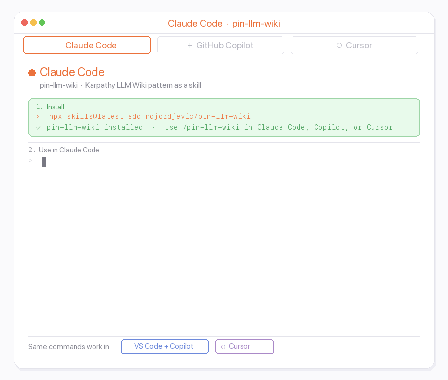

# pin-llm-wiki

A multi-editor skill that automates the [Karpathy LLM Wiki pattern](https://gist.github.com/karpathy/442a6bf555914893e9891c11519de94f): drop in URLs, get a local, citable, cross-referenced wiki that agents can read before answering.

**Where it runs:** [Claude Code](https://claude.com/product/claude-code) (slash commands), [GitHub Copilot](https://github.com/features/copilot) and [Cursor](https://cursor.com) (install the skill + follow the same workflows; see below).

## Why use it

`pin-llm-wiki` turns external sources into a durable knowledge base:

- `raw/` keeps immutable captures of the original sources.
- `wiki/` holds summarized, wikilinked pages with citations back to raw files.
- `AGENTS.md` tells AI agents to consult the wiki before answering domain questions.
- `inbox.md` gives humans and agents a simple queue for future sources.

The result is a repo-local memory layer: reviewable in git, queryable by agents, and less dependent on whatever context happens to fit in one chat.

## Install

Install with the [`skills` CLI](https://github.com/vercel-labs/skills) (`npx skills@latest`). Pick **project** (repo-local `./skills/`) or **global** (`-g`, user-wide agent dirs under `~/`).

```bash
# Project — wiki/repo root
mkdir my-wiki && cd my-wiki   # or: cd existing-repo
npx skills@latest add ndjordjevic/pin-llm-wiki

# Global
npx skills@latest add ndjordjevic/pin-llm-wiki -g
```

Target agents with **`-a`**, list without installing with **`--list`**, browse [skills.sh](https://skills.sh), full flags in `npx skills@latest add --help`.

## Update

Refresh the skill files from GitHub. Scope should match how you installed:

```bash
# Project install: from that repo’s root, or force project scope
npx skills@latest update pin-llm-wiki -p

# Global install
npx skills@latest update pin-llm-wiki -g
```

Use **`-y`** to skip interactive scope prompts (the CLI can auto-pick project vs global when only one applies). `skills update` may recreate agent directories you do not use; delete those folders if you want a minimal tree. See `npx skills@latest update --help`.

## Quickstart



Inside the repo that should become a wiki:

```bash
/pin-llm-wiki init
/pin-llm-wiki ingest https://github.com/org/repo
/pin-llm-wiki queue https://example.com
/pin-llm-wiki ingest
/pin-llm-wiki lint
```

After `init`, follow the generated wiki's `AGENTS.md`; it is the operating manual for agents working in that knowledge base.

## Commands

Use **`/pin-llm-wiki`** in the agent. Claude Code, Cursor, and GitHub Copilot all use the same `SKILL.md`.

| Subcommand | What it does |
|---|---|
| **`init`** | Scaffold `inbox.md`, `.pin-llm-wiki.yml`, `AGENTS.md`, `wiki/`, and `raw/` |
| **`ingest [url]`** | Ingest one URL, or omit `url` to process every pending item in `inbox.md` |
| **`queue <url> ...`** | Add URLs to `inbox.md` without fetching or ingesting |
| **`lint`** | Validate wiki health and apply light non-destructive fixes |
| **`remove <slug>`** | Soft-delete a source into `wiki/.archive/` |

Ingest rules, inbox HTML tags, companion repos, and multi-product deep mode live in `skills/pin-llm-wiki/SKILL.md` and its sibling workflow files.

## What gets created

```
inbox.md              source queue; drop URLs under ## Pending
.pin-llm-wiki.yml     config: domain, detail level, source types, lint cadence
AGENTS.md             canonical instructions for agents in the generated wiki
wiki/
  index.md            start here; full source list
  overview.md         rolling cross-source synthesis
  log.md              append-only ingest, refresh, and removal history
  sources/            one page per ingested source
  .archive/           soft-deleted sources
raw/
  github/             immutable GitHub repo captures
  youtube/            immutable YouTube transcripts + metadata
  web/                immutable web page captures
```

The wiki is Markdown with `[[wikilinks]]`; opening the repo as an [Obsidian](https://obsidian.md) vault is a comfortable way to read and navigate it (start from `wiki/index.md`).

## Demo wiki

For a maintained wiki built with this skill, see [ndjordjevic/agentic-ai-wiki](https://github.com/ndjordjevic/agentic-ai-wiki).

## Source types

Fetches are detail-aware: broader at `standard` / `deep` than at `brief`. Ingest then turns each raw capture into cited wiki pages (`ingest.md`).

| Type | Raw output | Smarts |
|---|---|---|
| GitHub | `raw/github/<org>-<repo>.md` | `gh`: metadata, README, repo layout, and more `docs/` at higher detail; `<!-- branch -->` / optional `<!-- clone -->` (deep). |
| YouTube | `raw/youtube/<video-id>-<slug>.md` | `yt-dlp`: description, chapters, cleaned transcript (or a no-transcript flag). |
| Web | `raw/web/<slug>.md` | Crawls landing + docs (plus `llms.txt` / sitemap where useful); often pulls a **companion** GitHub repo into one **unified** page unless `<!-- no-companion -->`. **`deep`** can **split multi-product sites**: one umbrella + one sub-page per product, still backed by **one** raw file—similar to how `langchain.com` becomes a hub plus pages like LangGraph / LangSmith. |

GitHub URLs with a path after the repo (`/tree/…`, `/blob/…`, …) are **single-page web** only: no full-repo ingest, companion discovery, or deep product split on that URL.

## Agent behavior

Generated wikis include `AGENTS.md`, which tells AI agents to:

- Read `wiki/index.md` before answering domain questions.
- Follow `[[wikilinks]]` into relevant source pages.
- Cite wiki page names in answers.
- Say when the wiki does not contain an answer, then fetch current information online.

Agents are also instructed not to run `git commit` or `git push` unless the human explicitly asks.

## Limits

This is a reviewable knowledge workflow, not an unattended publishing system. Generated pages should be inspected in git diffs. Large fetches have token guards, and Phase 1 lint defers contradiction and terminology-collision checks.
